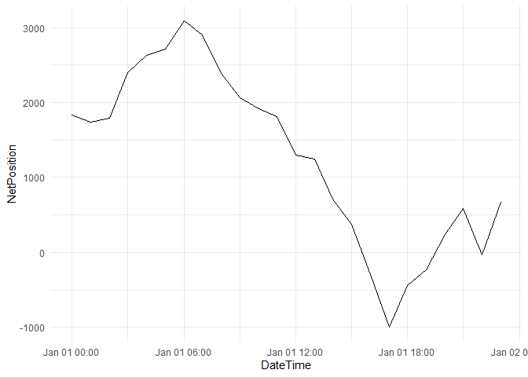

JAO Publication Tool
================

### Introduction

This package provides a number of wrapper functions to access the data
sets from the JAO Publication Tool. These data sets relate to the
calculation of cross-zonal electricity transmission capacity in
different European regions.

### JAO Publication Tool

Through the JAO Publication Tool (🔗 <https://publicationtool.jao.eu/>),
European transmission system operators (“TSOs”) publish, on a daily
basis, data sets related to cross-zonal transmission capacity
calculation.

Data sets are grouped per coordinated capacity calculation methodology.
For example, there are different data sets for the Core day-ahead
flow-based market coupling, the Core intraday capacity calculation,
Italy North coordinated net transfer capacities, etc.

### Usage

#### Installation

The package can be installed directly from this GitHub Repository:

``` r
install.packages("devtools")
devtools::install_github("nicoschoutteet/JAOPuTo")
```

#### Functions

Data can be downloaded directly into a tidy dataframe (tibble):

``` r
data <- JAOPuTo::JAOPuTo_Core_netpositions(as.POSIXct("2024-01-01 00:00", "CET"), 
                                           as.POSIXct("2024-01-01 23:00", "CET"))

utils::head(data)
```

    ## # A tibble: 6 × 4
    ##   DateTime            BiddingZoneAbb BiddingZone        NetPosition
    ##   <dttm>              <chr>          <chr>                    <dbl>
    ## 1 2024-01-01 00:00:00 ALBE           ALEGrO Belgium            192.
    ## 2 2024-01-01 00:00:00 ALDE           ALEGrO Germany           -192.
    ## 3 2024-01-01 00:00:00 AT             Austria                 -2416.
    ## 4 2024-01-01 00:00:00 BE             Belgium                  1833.
    ## 5 2024-01-01 00:00:00 CZ             Czech Republic           2013.
    ## 6 2024-01-01 00:00:00 DE             Germany/Luxembourg       6287.

or visualized by inputting it in a `ggplot` call:

``` r
JAOPuTo::JAOPuTo_Core_netpositions(as.POSIXct("2024-01-01 00:00", "CET"),
                                   as.POSIXct("2024-01-01 23:00", "CET")) %>% 
  dplyr::filter(BiddingZone == "Belgium") %>% 
  ggplot2::ggplot(aes(DateTime, NetPosition)) +
  ggplot2::geom_line() +
  ggplot2::theme_minimal()
```

<!-- -->

#### Documentation

The functions contain a brief description, including which function
parameters to declare (most often StartDateTime and EndDateTime) and a
brief description of the data that will be downloaded.

``` r
?JAOPuTo::JAOPuTo_Core_netpositions()
```

A more in-depth description of the datasets is found in the Publication
Handbooks:

- Core Day-Ahead: 🔗
  <https://publicationtool.jao.eu/core/CORE_PublicationHandbook>

- Core Intraday: 🔗
  <https://publicationtool.jao.eu/PublicationHandbook/Core_IDCC_PublicationTool_Handbook_v1.3.pdf>

### Package contents

At this stage, functions to access to the datasets from the Core
capacity calculation region are included in this package:

- Core Day-Ahead Flow-Based Market Coupling (“Core DA FBMC”, 🔗
  <https://publicationtool.jao.eu/core/>)

  - Monitoring (“Core_monitoring.R”)

  - Max net positions (“Core_maxnetpositions.R”)

  - Max Exchanges (“Core_maxexchanges.R”)

  - Initial computation - virgin domains (“Core_initialcomputatation.R”)

  - Remedial Actions Preventive (“Core_remedialactionspreventive.R”)

  - Remedial Actions Curative (“Core_remedialactionscurative.R”)

  - Validation Reductions (“Core_validationreductions.R”)

  - Pre-final computation (“Core_prefinalcomputation.R”)
 
  - Final computation ("Core_finalcomputation.R")

  - Long-Term Nominations (“Core_ltn.R”)

  - Long-Term Allocations (“Core_lta.R”)

  - Final Bilateral Exchange Restrictions (“Core_finalmaxexchanges.R”)

  - Allocation Constraints (“Core_allocationconstraints.R”)

  - D2CF (“Core_D2CF.R”)

  - Reference Programs (“Core_refprog.R”)

  - Reference Net Position (“Core_referencenetpositions.R”)

  - ATCs on Core external borders (“Core_atcexternalborders.R”)

  - ShadowAuction ATC (“Core_shadowauctionsATC.R”)

  - Shadow Prices (“Core_shadowprices.R”)

  - Congestion Income (“Core_congestionincome.R”)

  - Scheduled Exchanges (“Core_scheduledexchanges.R”)

  - Net Position (“Core_netpositions.R”)

  - Intraday ATC (“Core_intradayATC.R”)

  - Intraday NTC (“Core_intradayNTC.R”)

  - Price Spread (“Core_pricespreads.R”)

  - Spanning/DFP (“Core_spanningDFP.R”)

  - Alpha factor from MCP (“Core_alphafactor.R”)

- Core Intraday Capacity Calculation (“Core ID CCM”, 🔗
  <https://publicationtool.jao.eu/coreID/>)

  - ID Monitoring (“CoreID_monitoring.R”)

  - ID1/2/3 Congestion Income (“CoreID_ID1/2/3_congestionincome.R”)

  - ID1/2/3 Net Positions (“CoreID_ID1/2/3_netpositions.R”)

  - ID1/2/3 Scheduled Exchanges (“CoreID_ID1/2/3_scheduledexchanges.R”)

  - IDCC(a) Initial ATC (“CoreID_IDCCa_initialATC.R”)

  - IDCC(a) Initial NTC (“CoreID_IDCCa_initialNTC.R”)

  - IDCC(a) Final ATC (“CoreID_IDCCa_finalATC.R”)

  - IDCC(a) Final NTC (“CoreID_IDCCa_finalNTC.R”)

  - IDCC(b) Initial computation - virgin domains
    (“CoreID_IDCCb_initialcomputation.R”)

  - IDCC(b) Final computation (“CoreID_IDCCb_finalcomputation.R”)

  - IDCC(b) Max Exchanges (“CoreID_IDCCb_maxexchanges.R”)

  - IDCC(b) Max Net Positions (“CoreID_IDCCb_maxnetpositions.R”)
https://github.com/nicoschoutteet/JAOPuTo/blob/main/README.md
  - IDCC(b) Reference Net Positions
    (“CoreID_IDCCb_referencenetpositions.R”)

  - IDCC(b) Reference Programs (“CoreID_IDCCb_refprog.R”)

  - IDCC(b) Final ATC (“CoreID_IDCCB_finalATC.R”)

  - IDCC(b) Final NTC (“CoreID_IDCCb_finalNTC.R”)

  - IDCC(b) Validation Reductions
    (“CoreID_IDCCb_validationreductions.R”)

- Nordic Day-Ahead Flow-Based Market Coupling (“Nordic DA FBMC”, 🔗
  <https://publicationtool.jao.eu/nordic/>)
  - Monitoring (“Nordic_monitoring.R”)

  - Final computation ("Nordic_finalcomputation.R")

  - Shadow Prices (“Nordic_shadowprices.R”)
 
  - Max net positions (“Nordic_maxnetpositions.R”)
 
  - Net Position (“Nordic_netpositions.R”)
 
  - Max Border Flow ("Nordic_maxborderflow.R")
 
  - Max Exchanges ("Nordic_maxexchanges.R")

  - Reference Net Positions ("Nordic_referencenetpositions.R")
 
  - Spanning & DFP ("Nordic_spanningDFP.R")
 
  - Validation Reductions ("Nordic_validationreductions.R")

### Contact

This package is created and maintained by Nico Schoutteet

[
LinkedIn](https://www.linkedin.com/in/nicoschoutteet/ "External link to LinkedIn profile")

[
E-mail](mailto:n.schoutteet@gmail.com "Send e-mail")
